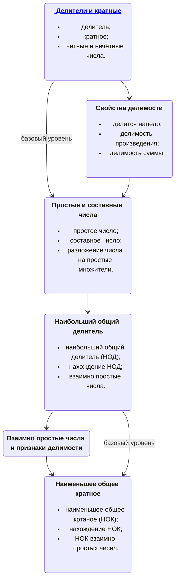

import BeautifulTable from '@site/src/components/BeautifulTable/BeautifulTable';

## Делимость натуральных чисел

Понимание `свойств делимости` чисел играет важную роль в изучении темы **"Обыкновенные дроби"**.

Для упрощения обыкновенных дробей необходимо использовать свойства делимости чисел, например, нахождение `наибольшего общего делителя` (НОД) числителя и знаменателя, чтобы сократить дробь.

Знание `свойств делимости` помогает находить общие знаменатели, складывать и вычитать дроби, а также упрощать результаты операций с дробями.

Например, при сложении обыкновенных дробей необходимо привести их к `общему знаменателю`. Хорошее знание свойств делимости помогает быстро находить `наименьшее общее кратное` (НОК) знаменателей и домножать каждую дробь на подходящий множитель, чтобы получить общий знаменатель.

### Дорожная карта темы "Делимость натуральных чисел"

#### [Делители и кратные](/docs/deliteli-i-kratnye)

[Лист для работы на уроке](./assets/01deliteli-i-kratnye-lesson.pdf)  
[Лист для домашней работы](./assets/01deliteli-i-kratnye-homework.pdf)  
