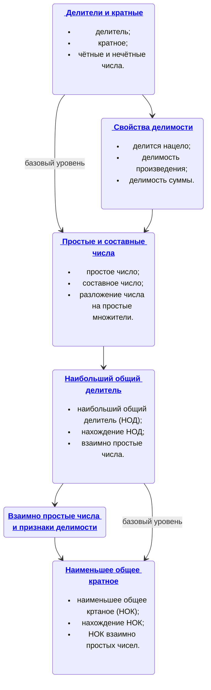

import BeautifulTable from '@site/src/components/BeautifulTable/BeautifulTable';

### Дорожная карта темы "Делимость натуральных чисел"

## Ресурсы темы

### [Делители и кратные](/docs/deliteli-i-kratnye)

[Делители и кратные (работа на уроке)](./assets/01deliteli-i-kratnye-lesson.pdf)  
[Делители и кратные (домашняя работа)](./assets/01deliteli-i-kratnye-homework.pdf)  

### [Свойства делимости чисел](/docs/svojstva-delimosti-chisel)

[Свойства делимости чисел (теория)](./assets/02svojstva-delimosti-chisel-theory.pdf)  
Практика урока в ресурсах темы [Простые и составные числа](/docs/prostye-i-sostavnye-chisla#pr)

### [Простые и составные числа](/docs/prostye-i-sostavnye-chisla)

[Простые и составные числа ( теория)](./assets/03prostye-i-sostavnye-chisla-theory.pdf)  
[Простые и составные числа (работа на уроке)](./assets/03prostye-i-sostavnye-chisla-lesson.pdf)  
[Простые и составные числа ( домашняя работа)](./assets/03prostye-i-sostavnye-chisla-homework.pdf)

### [Наибольший общий делитель](/docs/naibolshij-obshchij-delitel)

[Наибольший общий делитель (работа на уроке)](./assets/04naibolshij-obshchij-delitel-lesson.pdf)  
[Наибольший общий делитель (домашняя работа)](./assets/04naibolshij-obshchij-delitel-homework.pdf)  

### [Наименьшее общее кратное](/docs/naimenshee-obshchee-kratnoe)

[Наименьшее общее кратное (работа на уроке)](./assets/05naimenshee-obshchee-kratnoe-lesson.pdf)
